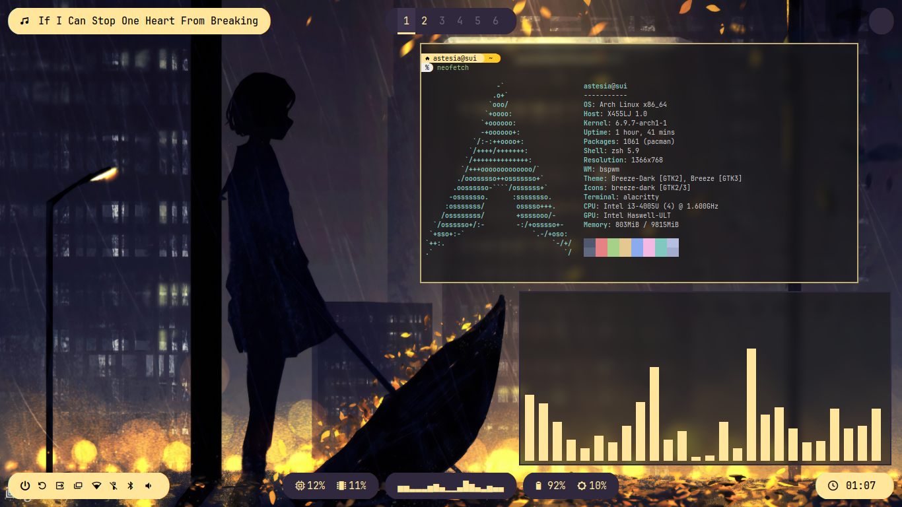
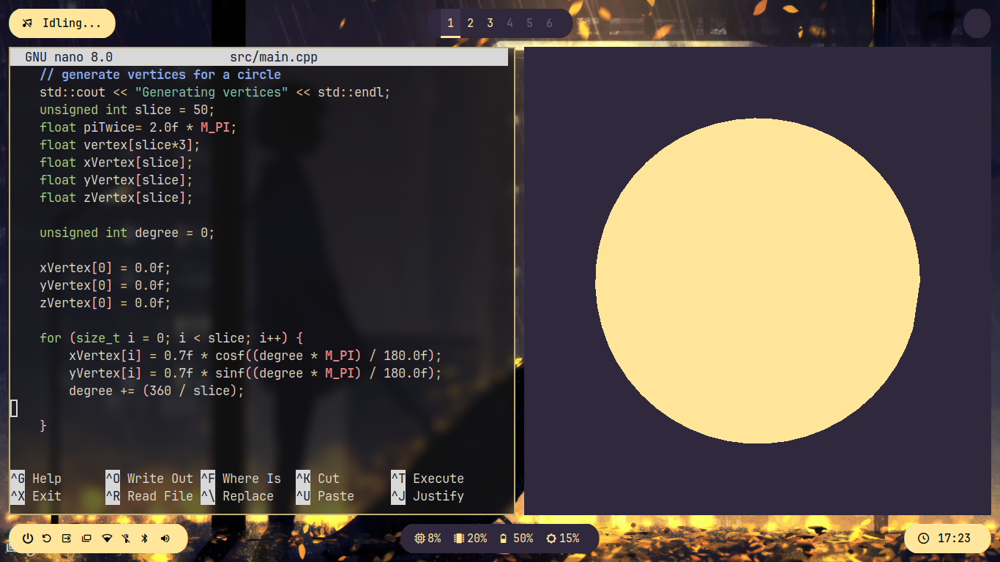

# dotfiles and scripts
This is my collection of scripts and dotfiles that i used. This thing exist because i dont want reconfigure my system when my laptop decided to break itself. Feel free to use this however you want

## Preview

## Features
- Audio visualizer (optional)
- Bluetooth and wifi on/off switch
- Compositor on/off switch
- "Now Playing" status bar
- System informations (RAM, CPU, battery, brightness, temperature)
- System tray

## Requirements

### Fonts
- JetBrainsMono Nerd Font Mono (Regular, Bold, Italic, Bold Italic)
- JetBrainsMono Nerd Font (Medium)
- Noto Fonts CJK

### Miscellaneous
- Nano syntax highlighting plugins
- ZSH shift select plugins
- ZSH syntax highlighting plugins

### Apps
- Alacritty
- bspwm
- btop
- CAVA
- Compfy
- Polybar
- sxhkd
- yapl (included on [dotfiles](dotfiles/sxhkd))
- ZSH

## Notes
- You **have** to configure `yapl` before using it, see [this](https://github.com/hithere-at/yapl?tab=readme-ov-file#configuration) for the configuration layout.
- I am not using rofi and dunst because im too lazy to configure them.
- This bar updates is too long
- You need to install this dotfiles manually, meaning some wont work out of the box (e.g sxhkd, bspwm). Some of the configuration needs to be edited to suit your PC.
